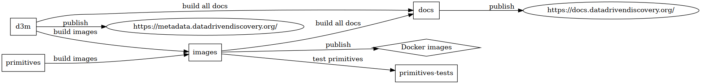

.. _contribute:

Contribute to Core Package
--------------------------

You are invited to help and contribute to the core package.
Development happens in `this repository <https://gitlab.com/datadrivendiscovery/d3m>`__.

A great way to start contributing is to check out
`open issues suitable for new contributors <https://gitlab.com/datadrivendiscovery/d3m/-/issues?label_name%5B%5D=good+for+new+contributors>`__
and consider tackling one of them. Leave a comment in the issue before you start to let others know that you are working on this issue to reduce crossover. If you are unclear about any aspect of the issue you are encouraged to ask for more information through comments of the issue, too.

Reporting Issue
~~~~~~~~~~~~~~~

Please report any issue using our `issue tracker <https://gitlab.com/datadrivendiscovery/d3m/-/issues>`_.

Repository Structure
~~~~~~~~~~~~~~~~~~~~

``master`` branch contains latest stable release of the package.
``devel`` branch is a staging branch for the next release.
Always make merge requests against ``devel`` branch.

Releases are
`tagged <https://gitlab.com/datadrivendiscovery/d3m/-/tags>`__.

Code Style
~~~~~~~~~~

See the `CODE_STYLE.md <https://gitlab.com/datadrivendiscovery/d3m/blob/devel/CODE_STYLE.md>`__ document in the repository for our coding
style and contribution guide. Please ensure any merge requests you open follow this guide.

Testing Core Package
--------------------

To ensure consistent performance of the D3M package a test suite and performance benchmarks are ran in the CI pipeline after every commit.
If a commit fails tests or introduces significant performance regression the pipeline fails.

Installing Test Dependencies
~~~~~~~~~~~~~~~~~~~~~~~~~~~~

The test suite has extra dependencies that can be installed using
`setuptools extras <https://packaging.python.org/tutorials/installing-packages/#installing-setuptools-extras>`__ with the ``[tests]`` extra.
To install directly from GitLab::

    $ pip3 install -e git+https://gitlab.com/datadrivendiscovery/d3m.git@devel#egg=d3m[tests]

or from inside the cloned repo::

    $ pip3 install -e .[tests]

Running Tests
~~~~~~~~~~~~~

To run the test suite locally run::

    $ ./run_tests.py

Running Benchmarks
~~~~~~~~~~~~~~~~~~

If you want to run benchmarks locally you first need to install `asv <https://asv.readthedocs.io>`__::

    $ pip install asv

then clone the D3M repository::

    $ git clone --recursive git@gitlab.com:datadrivendiscovery/d3m.git
    $ cd d3m/tests

and run the benchmarks on a set of git commits. The following command::

    asv continuous --config asv.conf.json --split --factor 1.1 --show-stderr devel HEAD

will benchmarks changes between last commit to ``devel`` and latest commit to currently active feature branch.
Make sure the code you want to benchmark is committed into active git branch.

To inspect performance changes between last two commits in the active branch run::

    $ asv continuous --config asv.conf.json -f 1.1 HEAD
    · Creating environments
    · Discovering benchmarks
    ·· Uninstalling from virtualenv-py3.6
    ·· Installing a1bb2749 <asv_benchmarks> into virtualenv-py3.6.
    · Running 4 total benchmarks (2 commits * 1 environments * 2 benchmarks)
    [  0.00%] · For d3m commit 3759f7a7 <asv_benchmarks~1> (round 1/2):
    [  0.00%] ·· Building for virtualenv-py3.6.
    [  0.00%] ·· Benchmarking virtualenv-py3.6
    [ 12.50%] ··· Running (metadata.DatasetMetadata.time_update_0k--)..
    [ 25.00%] · For d3m commit a1bb2749 <asv_benchmarks> (round 1/2):
    [ 25.00%] ·· Building for virtualenv-py3.6.
    [ 25.00%] ·· Benchmarking virtualenv-py3.6
    [ 37.50%] ··· Running (metadata.DatasetMetadata.time_update_0k--)..
    [ 50.00%] · For d3m commit a1bb2749 <asv_benchmarks> (round 2/2):
    [ 50.00%] ·· Benchmarking virtualenv-py3.6
    [ 62.50%] ··· metadata.DatasetMetadata.time_update_0k               2.84±0.4ms
    [ 75.00%] ··· metadata.DatasetMetadata.time_update_1k                  174±4ms
    [ 75.00%] · For d3m commit 3759f7a7 <asv_benchmarks~1> (round 2/2):
    [ 75.00%] ·· Building for virtualenv-py3.6.
    [ 75.00%] ·· Benchmarking virtualenv-py3.6
    [ 87.50%] ··· metadata.DatasetMetadata.time_update_0k               5.59±0.5ms
    [100.00%] ··· metadata.DatasetMetadata.time_update_1k                 714±10ms
           before           after         ratio
         [3759f7a7]       [a1bb2749]
         <asv_benchmarks~1>       <asv_benchmarks>
    -      5.59±0.5ms       2.84±0.4ms     0.51  metadata.DatasetMetadata.time_update_0k
    -        714±10ms          174±4ms     0.24  metadata.DatasetMetadata.time_update_1k

During development, you can run a particular benchmark using the current environment and code by::

    $ asv dev --config asv.conf.json --bench 'metadata.DatasetToJsonStructure.time_to_json_structure.*'

For additional reference the following resources can be useful:

*  `Pandas performance test suite guide <http://pandas.pydata.org/pandas-docs/stable/development/contributing.html#running-the-performance-test-suite>`__
*  `Asv usage guide <https://asv.readthedocs.io/en/stable/using.html>`__
*  `Astropy benchmarks <https://github.com/astropy/astropy-benchmarks>`__

Continuous Integration
----------------------

We use GitLab CI for all our repositories, not only to run tests but also build Docker images, deploy documentation, etc. Some repositories trigger rebuilds of other repositories:

``d3m`` core package
~~~~~~~~~~~~~~~~~~~~

* Deploys pages at https://metadata.datadrivendiscovery.org/
	* Just contains schemas
* Triggers "images rebuild devel"
    * Only for `devel` branch pushes
	* `datadrivendiscovery/images`
	* `ref=master`
	* `REBUILD_IMAGE=core:ubuntu-bionic-python36-devel,core-lite:ubuntu-bionic-python36-devel`
* Triggers "image rebuild master"
    * Only for `master` branch pushes
	* `datadrivendiscovery/images`
	* `ref=master`
	* `REBUILD_IMAGE=core:ubuntu-bionic-python36-master,core-lite:ubuntu-bionic-python36-master`
* Triggers "docs generation"
    * Only for `devel` branch pushes & new tags
	* `datadrivendiscovery/docs`
	* `ref=master`

``primitives``
~~~~~~~~~~~~~~

* Triggers "images rebuild"
	* `datadrivendiscovery/images`
	* `ref=master`

``images``
~~~~~~~~~~

* Triggers "docs generation"
	* `datadrivendiscovery/docs`
	* `ref=master`
* Triggers "primitives tests"
    * `datadrivendiscovery/primitives-tests``
    * `ref=master`
    * Tests primitives in the new image
* Builds and pushes Docker images from CI: `registry.gitlab.com/datadrivendiscovery/images/${WHAT}:ubuntu-bionic-python36`

``docs``
~~~~~~~~

* No triggers
* Deploys pages at https://docs.datadrivendiscovery.org/

``sklearn-wrap``
~~~~~~~~~~~~~~~~

* No triggers
* Updates its `dist` and `dev-dist` branches from CI

``automl-rpc``
~~~~~~~~~~~~~~

* No triggers
* Updates its `dist-${LANG}` and `dev-dist-${LANG}` from CI where `${LANG}` is `golang`/`python`/`javascript`

``dummy-ta3``
~~~~~~~~~~~~~

* No triggers
* Builds and pushes Docker images from CI: `registry.gitlab.com/datadrivendiscovery/dummy-ta3/dummy-ta3:${VERSION}`

``primitives-tests``
~~~~~~~~~~~~~~~~~~~~

* No triggers
* Deploys pages at https://datadrivendiscovery.gitlab.io/primitives-tests/

``common-primitives``
~~~~~~~~~~~~~~~~~~~~~

* No triggers
* Runs tests

``tests-data``
~~~~~~~~~~~~~~

* No triggers
* Runs tests
* Builds ``summing`` Docker image for test primitive that uses Docker

``simple-ta3``
~~~~~~~~~~~~~~

* No triggers
* Builds Docker images

Contribute Documentation
------------------------
